# Video Game Trivia

## Project Overview

[Video Game Trivia](https://court-pencil.github.io/Game-Trivia/)

The Video Game Trivia is an app where you can test your video game knowledge. There is a start screen which is in the style of a retro games that is inspired from the early NES console graphics to give that novelty feeling. 10 quiz questions that are fetched from a API and the questions are different each time you play the quiz. Once the quiz is completed it takes you to a results page and shows the users how much they scored and there is a retry button that once clicked will bring you back to the start screen for the user to play again, with new questions loaded each time. 

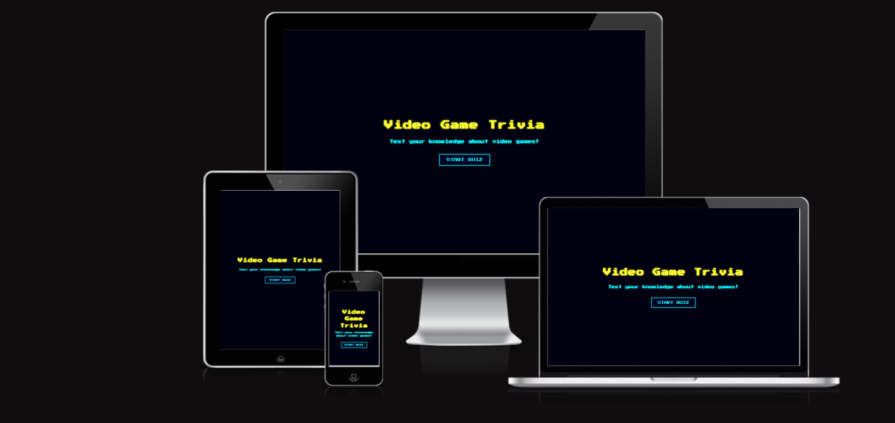

## Project Rationale
The Video Game Trivia app was created to offer users a simple and enjoyable way to test their gaming knowledge through a fun, fast-paced quiz experience. Many trivia apps focus on general topics, so this project aims to provide a dedicated space specifically for video game fans. The retro-inspired design helps capture the nostalgia of early gaming, making the experience more engaging for users. By fetching new questions each time, the app encourages replayability while giving users the chance to learn new facts and improve their score with every attempt.

[Contents]()

- [User Goals](#user-goals)
- [User Stories](#user-stories)
- [Website Goals and Objectives](#website-goals-and-objectives)
- [Wireframes](#wireframes)
- [Design Choices](#design-choices)
  - [Typography](#typography)
  - [Colour Scheme](#colour-scheme)
  - [Images](#images)
  - [Responsiveness](#responsiveness)
- [Features](#features)
  - [Existing Features](#existing-features)
    - [StartScreen](#start-screen)
    - [Quiz questions](#quiz-questions)
    - [Real time feedback](#real-time-feedback)
    - [Score tracking](#score-tracking)
    - [Replay Button](#replay-again)
    - [Thematic styling](#thematic-styling)
    - [End Screen](#end-screen)
  - [Future Enhancements](#future-enhancements)
- [Technologies Used](#tech-used)
  - [Languages](#languages)
  - [Libraries & Framework](#libraries-framework)
  - [Tools](#tools)
- [Testing](#testing)
  - [Bugs Fixed](#bugs-fixed)
  - [Responsiveness Tests](#responsiveness-tests)
  - [Code Validation](#code-validation)
    - [HTML](#html)
    - [CSS](#css)
    - [Javascript](#javascript)
  - [User Story Testing](#user-story-testing)
  - [Feature Testing](#feature-testing)
  - [Acessibility Testing](#acessibility-testing)
  - [Lighthouse Testing](#lighthouse-testing)
  - [Brower Testing](#browser-testing)
- [Deployment](#deployment)
  - [To deploy the project](#deploy-project)
  - [To fork the project](#fork-project)
  - [To clone the project](#clone-project)
- [Credits](#credits)

## User Goals

- Provide user-friendly navigation for a seamless quiz experience.
- Receive immediate feedback on answers to learn from mistakes.
- Track progress and score through the quiz.
- Enjoy a visually engaging and responsive interface.
- Restart the quiz easily to replay or improve results.
- Access the app on any device, including mobile phones and tablets.
- Include relevant and engaging questions in the quiz.

## User Stories

- As a user, I want my knowledge of video games to be challenged so i can test my skills and learn new facts.
- As a user, I want to receive immediate feedback on my quiz answers so i can see if i answered correcty and improve if im incorrect.
- As a user, I want navigation to be intuitive and straightforward so i can move through the quiz without confusion.
- As a user, I want a visually appealing interface that enhances the overall experience so the quiz experience is engaging and enjoyable.
- As a user, I want the scoring system to be transparent and understandable so i understand my preformance through the quiz.
- As a user, I want to access the quiz on any device, including mobile phones and tablets so i can play anywhere, anytime.

## Website Goals and Objectives

- Provide an entertaining and engaging quiz experience for users.
- Include a variety of video game topics to appeal to a wide audience.
- Offer immediate feedback to enhance learning and enjoyment.
- Increase user interaction by allowing quizzes to be replayed and scores tracked.
- Maintain high performance and responsiveness across all devices.
- Encourage repeat visits by providing motivational messages and smooth quiz flow.

## Target Audience

- Video game enthusiasts – people who play or follow video games and enjoy testing their knowledge.
- Quiz enthusiasts – people who enjoy trivia games and challenges.
- Pop culture fans – people interested in gaming, anime, or nerd culture who enjoy quizzes about media.

## Wireframes

Wireframes for the quiz were created using Balsamiq, starting with mobile layouts before adapting them for tablet and laptop screens. The wireframes were intentionally simple: a landing page with a title and start button, a quiz screen featuring a question counter, question text, four answer options, a score counter, and a next button, followed by an end screen displaying a completion message, score out of 10, feedback text, and a play-again button. The final design stays close to the wireframes, with small improvements made during development to enhance usability and overall flow. These wireframes acted as a clear foundation for creating a focused and intuitive quiz experience.

### UX Design

The UX design of the quiz focuses on clarity, simplicity, and ease of use to ensure a smooth experience for all users. The interface avoids unnecessary visual clutter, presenting only essential elements such as the current question, answer options, and score, which helps maintain focus and reduce cognitive load. The linear structure—Start → Quiz → Results—provides a clear and intuitive flow, allowing users to navigate the quiz without confusion. Consistent styling, readable typography, and clear visual feedback for correct and incorrect answers enhance user engagement and make the experience more interactive. The end screen delivers a concise summary of the user’s performance along with a motivational message and a replay option, supporting continued participation and learning. Overall, the design prioritises accessibility, responsiveness, and user enjoyment across all devices

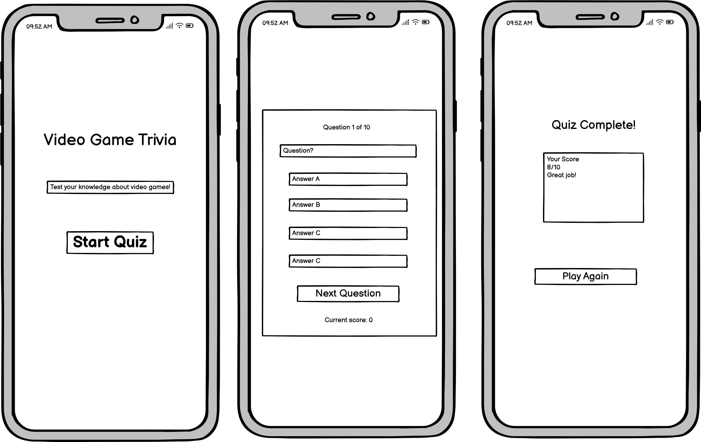
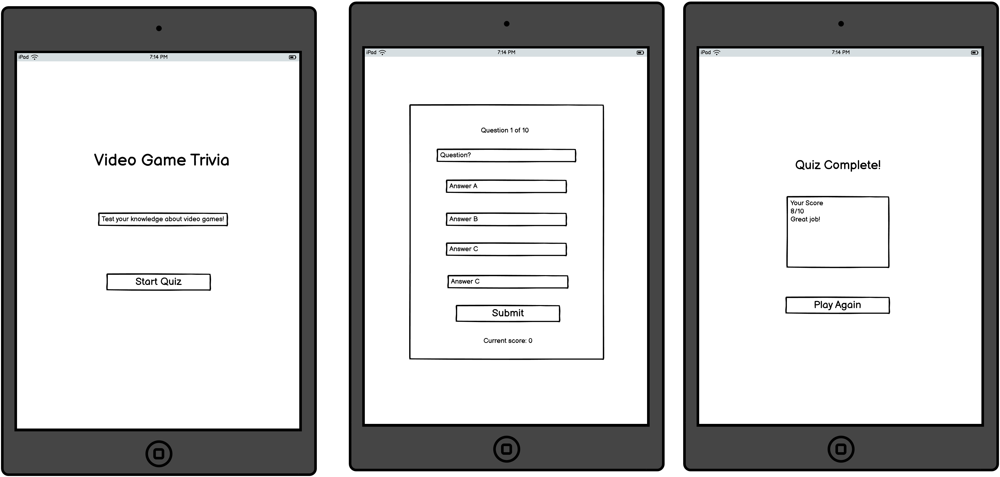
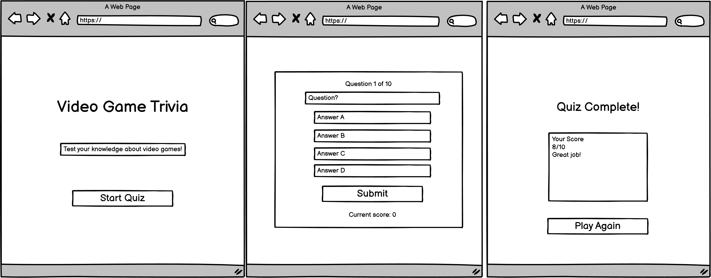

## Design Choices

### Typography

The font family chosen for the Video Game Trivia website is [Press Start 2P](https://fonts.google.com/specimen/Press+Start+2P) for the primary font. Lato for the secondary font. These were chosen for replicating nes font to give that retro vibe, to bring a nostaligic feeling to the user.

### Colour Scheme

The chosen colour scheme is inspired by the classic NES Pac-Man aesthetic, utilising a deep dark background paired with bright yellow text. This contrast not only enhances readability but also evokes a sense of nostalgia that many users instantly recognise. The neon cyan accents further support the retro arcade theme, creating a vibrant and engaging visual style throughout the quiz. Overall, the palette reinforces the gaming atmosphere while maintaining strong clarity and accessibility.

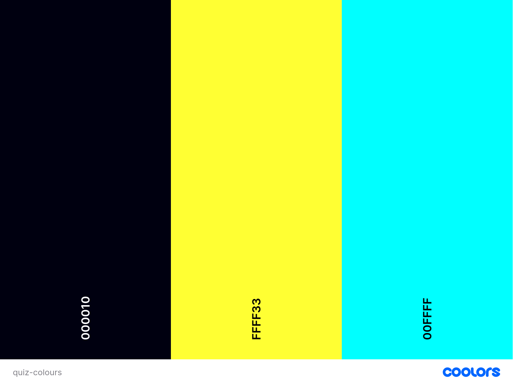

I used [Contrast Grid](https://contrast-grid.eightshapes.com/ "Contrast Grid") to check effective color pairings that support readability and to identify combinations that may hinder legibility due to insufficient contrast or visual discomfort.

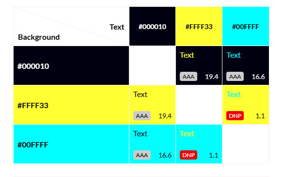

| CSS Name        | HEX       | Comment                 |
|-----------------|-----------|-------------------------|
| --neon-yellow | #ffff33   | Primary colour          |
| --neon-blue  | #00ffff   | Second colour           |
| --teal       | #00ffff55 | button shadow           |
| --black       | #000010   | Background              |
| --navy       | #000020   | background of buttons   |
| --green       | #22c55e   | Correct answer colour   |
| --red         | #ef4444   | Incorrect answer colour |

### Responsiveness

My App is repsonsive to all screen sizes. 
| Breakpoint | Class infix | Dimensions | | |
|-------------------|-------------|------------|---|---|
| Extra small | None | <576px | | |
| Small | sm | ≥576px | | |
| Medium | md | ≥768px | | |
| Large | lg | ≥992px | | |
| Extra large | xl | ≥1200px | | |
| Extra extra large | xxl | ≥1400px | | |

## Features

The interactive quiz interface is a clean and responsive UI that invites the user to test their video game knowledge. The layout is intutive, with a clear call-to-action to start the quiz.
Mobile-First Responsive Design – Built with a mobile-first approach to ensure the site looks and works seamlessly on phones, tablets, and desktops.

## Existing Features

### Start Screen

The start screen features a 'Start Quiz' button that launches the trivia experience, making it easy for users to get started.

### Quiz questions

The questions have multiple choice answers. Each question has four answer options, giving the user a familiar and accessible format.

### Real time feedback

When a answer is selected, the user recieves immediate visual feeback indicating whether their choice was correct or incorrect. This helps reinforce engagment and learning.

### Score tracking

The score is kept track throughout the quiz, once at the end of the quiz the user sees their score out of ten and a percentage.

### Replay Button

At the end of the quiz when the user has completed, they are given the option to play again. Which brings them back to the start screen to play again.

### Thematic styling

The use of the retro style on the app from the retro-inspired colour pallette and typography relfects the classic video game  aesthetic, echancing thematic experience.

### End Screen

The end screen has a smooth transition displaying the users score. A final score is displayed alongside a completion message depending on the score the user got, it returns a different message and a play again button to restart the quiz.

## Future Enchancements

### Difficulty section
Users would be able to choose their preferred challange level before starting the quiz.
It would include easy, medium and hard mode. Easy mode for casual play, straightforward questions and no time limit. Medium would be for a balanced experience, moderately challanging questions with no time limit. Hard mode would be for seasoned gamers, this would feature challanging and niche questions and a time constraint. This feature enhances accessibility and replayability, allowing users to tailor the experience to their skill level or mood.

### Time challange(Hard mode)
For Hard mode, a countdown timer will be there for each question. The user would have to answer before the time runs out e.g. 10 seconds, adding urgency and excitment. If the timer runs out the question is marked incorrect and moves to the next question. This mechanic increases the pressure and rewards fast recall, making the quiz more engaging for competitive or experienced users.

###  Scoreboard System
A scoreboard will track and display high scores across sessions. Users can see their best scores and compare them with others (or their own previous attempts). - The scoreboard may include player initials, score, difficulty level, and date achieved.
This feature encourages replayability and adds a competitive edge, perfect for sharing with friends or challenging yourself to improve.

## Technologies Used

### Languages

- HTML
- CSS
- React JS

### Libraries & Framework

- [Google Fonts](https://fonts.google.com/selection)

### Tools

- [Github](https://github.com/)
- [Balsamiq](https://balsamiq.com/)
- [W3C HTML Validation Service](https://validator.w3.org/)
- [W3C CSS Validation Service](https://jigsaw.w3.org/css-validator/)
- [Open Trivia DB](https://opentdb.com/ "Open Trivia DB")
- [WAVE Accessibility Tool](https://wave.webaim.org/ "WAVE Accessibility Tool")
- [Am I Responsive](https://ui.dev/amiresponsive "Am I responsive")
- [ESLint](https://eslint.org/docs/latest/use/getting-started)
- [Vite](https://vite.dev/)

## Testing

## Bugs

| Bug | Status | Description | Resolution Steps |
|-----|--------|-------------|------------------|
| **API not displaying questions and answers** | Fixed | Blank UI with console showing two sets of arrays | Added dependency array to `useEffect` and implemented flag to prevent double fetch |
| **Blank screen on deployment** | Fixed | App worked locally but showed nothing on GitHub Pages with no console errors | Removed `homepage` field from `package.json` to allow correct routing |
| **Double rendering in console** | Fixed | Console logged arrays twice due to state update clashes | Wrapped fetch logic in `useRef` guard to handle React Strict Mode double renders |
| **Answer buttons remained clickable after selection** | Fixed | Users could click multiple answers for the same question, affecting score accuracy | Added disabled state to all answer buttons after first selection and reset on next question |
| **Score not updating correctly** | Fixed | Final score was incorrect or stuck | Refactored score logic to update only on correct answers with proper condition checks |
| **Quiz restarted unexpectedly** | Fixed | Quiz reset mid-way or after answering | Lifted state up and memoized quiz component to preserve state across renders |

### Responsiveness Tests

To ensure a smooth experience across devices, I tested the quiz app early and often using a mobile-first approach. I relied on Chrome DevTools to simulate various screen sizes during development, checking layout, navigation, and interactive behavior. After deployment, I used Am I Responsive to preview the live site across multiple breakpoints and identify any layout inconsistencies.

| Device / Screen Size | Expected Behaviour                      | Actual Result                                     | Pass/Fail | Notes             |
|----------------------|-----------------------------------------|---------------------------------------------------|-----------|-------------------|
| iPhone SE            | Layout fits screen, buttons easy to tap | Works as expected                                 | Pass      |                   |
| iPhone 12            | No overflow, text readable              | Works as expected                                 | Pass      |                   |
| Pixel 7              | Buttons scale correctly, no clipping    | Works as expected                                 | Pass      |                   |
| iPad mini            | Layout expands but stays centred        | Works as expected                                 | Pass      |                   |
| iPad Pro             | Content does not stretch too wide       | opposite problem little too small on the screen   | Fail      | Working in progress |
| Nest Hub             | Fully readable, centred content         | Works as expected                                 | Pass      |                   |
| Next Hub Max         | Max-width applied, UI stable            | Works as expected, little too small on the screen | Fail      | Work in progress |

## Manual Testing (Android Device)

A manual walkthrough of the quiz app was performed on an Google Pixel 7 mobile device to confirm responsiveness, usability, and visual clarity.  
The GIF below demonstrates the application being used on an actual device:

This recording showcases:
- The landing page functionality  
- Navigation through quiz questions  
- The score update process  
- Answer selection and feedback  
- The final results screen  
- Overall responsiveness and smooth user interaction

This visual evidence supports the results documented in the Responsive Testing Table.

### User Story BDD Testing

---

### User Story 1 — Challenge my knowledge of video games

| Category | Details |
|---------|---------|
| **User Story** | As a user, I want my knowledge of video games to be challenged so I can test my skills and learn new facts. |
| **Scenario** | Starting the quiz |
| **Given** | The user is on the landing page |
| **When** | They click the “Start Quiz” button |
| **Then** | The first question is displayed |
| **Result** |  Pass |
| **Evidence** | [Screenshot of the first question](src/docs/user-story-testing-one.png) |

---

### User Story 2 — Receive immediate feedback on quiz answers

| Category | Details |
|---------|---------|
| **User Story** | As a user, I want to receive immediate feedback on my quiz answers so I can see if I answered correctly and improve if I’m incorrect. |
| **Scenario** | Answer feedback |
| **Given** | A question is displayed |
| **When** | The user selects an answer |
| **Then** | Correct answers highlight green; incorrect answers highlight red, and the correct answer is shown |
| **Result** |  Pass |
| **Evidence** | [Screenshot of incorrect feedback](src/docs/user-story-testing-two.png) [Screenshot of correct feedback](src/docs/user-story-testing-two-c.png) |

---

### User Story 3 — Navigation is intuitive and straightforward

| Category | Details |
|---------|---------|
| **User Story** | As a user, I want navigation to be intuitive and straightforward so I can move through the quiz without confusion. |
| **Scenario** | Moving between questions |
| **Given** | Feedback for the current question is displayed |
| **When** | The user clicks “Next Question” |
| **Then** | The next question loads smoothly and logically |
| **Result** |  Pass |
| **Evidence** | [Screenshot of next question button](src/docs/user-story-testing-next-q.png) / [navigation flow](src/docs/user-story-testing-three.png) |

---

### User Story 4 — Visually appealing interface

| Category | Details |
|---------|---------|
| **User Story** | As a user, I want a visually appealing interface that enhances the overall experience so the quiz experience is engaging and enjoyable. |
| **Scenario** | Viewing the quiz interface |
| **Given** | The quiz page loads |
| **When** | The user views the page |
| **Then** | The retro colour scheme, readable text, and clean layout are visible |
| **Result** |  Pass |
| **Evidence** | [Screenshot of quiz interface](src/docs/user-story-testing-four.png) |

---

### User Story 5 — Scoring system is transparent

| Category | Details |
|---------|---------|
| **User Story** | As a user, I want the scoring system to be transparent and understandable so I understand my performance throughout the quiz. |
| **Scenario** | Score tracking |
| **Given** | The user is answering questions |
| **When** | The score changes |
| **Then** | The score updates visibly on screen |
| **Scenario** | End of quiz |
| **Given** | The user completes the quiz |
| **When** | The results page loads |
| **Then** | Final score and a performance message are displayed clearly |
| **Result** |  Pass |
| **Evidence** | [Screenshot of score display and end screen](src/docs/user-story-testing-five.png) |

---

### User Story 6 — Accessible on any device

| Category | Details |
|---------|---------|
| **User Story** | As a user, I want to access the quiz on any device, including mobile phones and tablets, so I can play anywhere, anytime. |
| **Scenario** | Responsive layout |
| **Given** | The quiz is opened on different devices |
| **When** | The screen size changes |
| **Then** | All quiz elements remain readable, functional, and well-aligned |
| **Result** |  Pass |
| **Evidence** | [Screenshots on mobile, tablet, and desktop](src/docs/all-screen-sizes-image.png) |

## Code Validation

### CSS

I have used [W3C CSS Validation Service](https://jigsaw.w3.org/css-validator/). It returned errors relating to an old way of anti-alisasing of font. I was using this to make sure the pixelated font always appeared crisp on all browers otherwise it would take away from the style of the quiz. I updated it by deleting it and replacing it with -webkit-font-smoothing: antialiased;
 to keep the crisp edges of my pixelated font. The other errors were relating to extensions for different browers, the use of the same colour for border and background on the .answer-btn.correct and .answer-btn.incorrect. I removed the border as i liked how it looked as it was and the border was deemed unnecessary. I ran the test again  after the improvements and it passed.
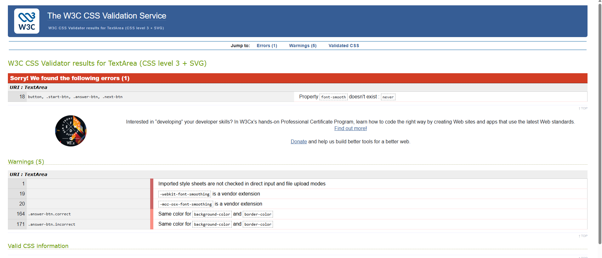
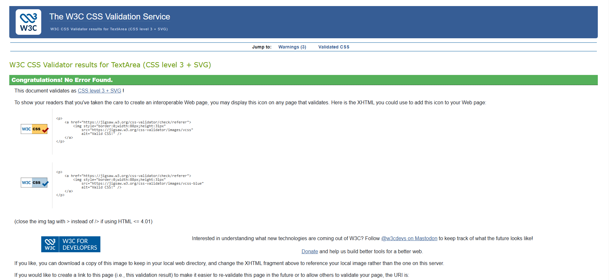

### HTML

I have used [W3C HTML Validation Service](https://validator.w3.org/). The tests came back with no errors. There was 3 info messages about trailing slash on void elements but that doesnt indicate any problems just showing best practices. Having used vite for my React js app i have no changed the trailing slashes on the index HTML as it was set up that way and doesnt pose any problems to the functioning of the app.

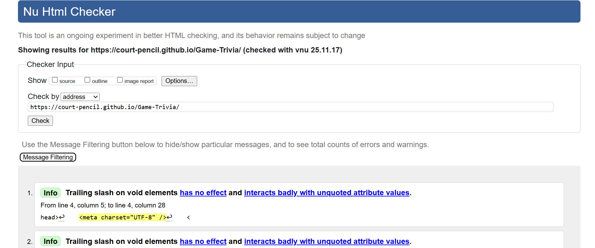
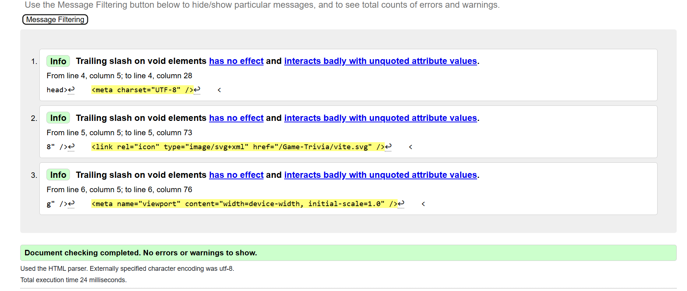

### Javascript 

Reactjs code validated by [ESlint](https://eslint.org/) through VSCode plug-in. ESLint was used to ensure code quality and identify potential issues during development. 1 error was indentfied. 
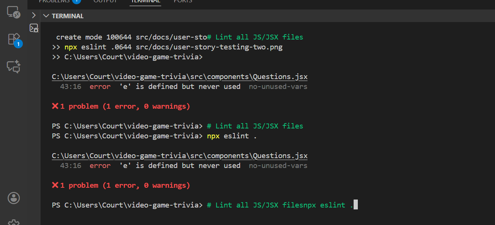. After correction by removing the unused error parameter, ESLint was run again and returned no errors, demonstrating that the code now adheres to the configured linting rules. 

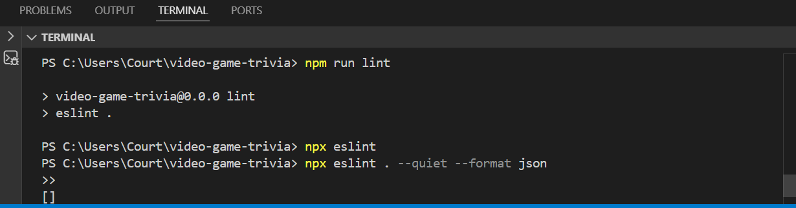
ESLint ran successfully and returned no errors or warnings, indicating the code meets all linting rules.

## Accessibility Testing

I used the web accessibilty evalution tool [WAVE](https://wave.webaim.org/) to test if my quiz app is accessible to people with diverse needs. One alert was raised, because this is a single page application there are no defined page regions to support improved navigation for assistive technologies. I also used the colour contrast checker on WAVE's site for additional checking.

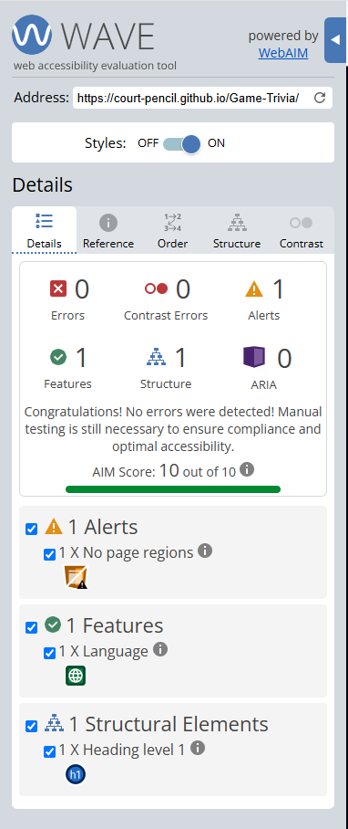
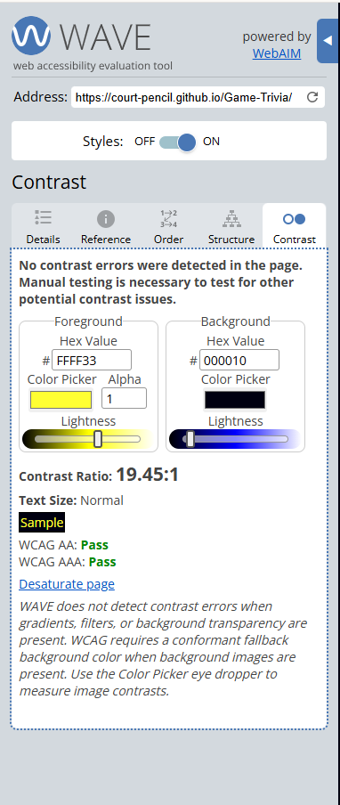

## Feature Testing

This website was extensively tested for functionality using Chrome developer tools.

## Lighthouse Testing

The Video Game Trivia website has been tested in Chrome Dev Tools using Lighthouse Testing tool which inspects and scores the website for the following criteria. I generated two sets of lighthouse reports, one for mobile and one for desktop. 

- Performance - how quickly a website loads and how quickly users can access it.
- Accessibility - test analyses how well people who use assistive technologies can use your website.
- Best Practices - checks whether the page is built on the modern standards of web development.  
- SEO - checks if the website is optimised for search engine result rankings.

## Mobile chrome Dev tools testing:
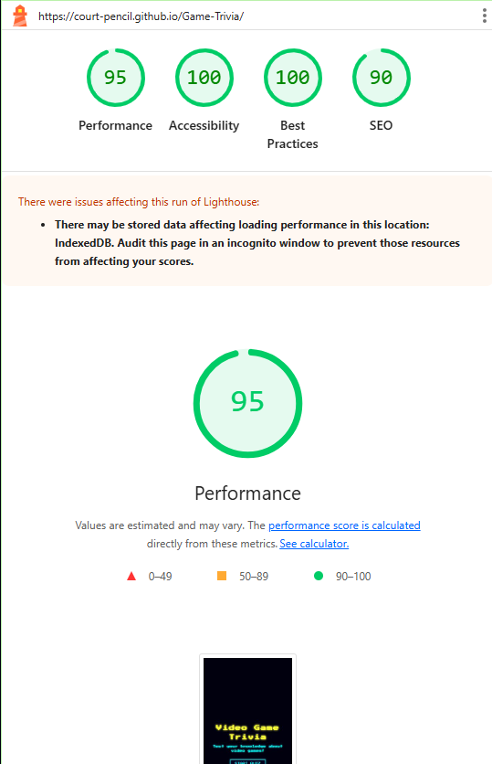
 

## Desktop chrome Dev tools testing:
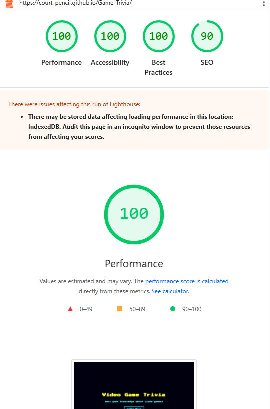
 
## Known Issues / Limitations
* Ipad Pro content appears slightly too small on the screen. These layout adjustments are still in progress and will be fixed.
* Nest Hub Max screen content appears small than desired but responsive improvments are planned.
* one ARIA alert to provide screen-reader feedback, but because it is a single-page application, there are currently no ARIA page regions. This may affect navigation for assistive-technology users. Improvements are planned for future updates.

## Deployment

### To deploy the project

The  Video Game Trivia  deployed early in the process using vite and GitHub pages via the following steps:

1. Install GitHub Pages Deployment Tool:
 - In your project, install gh-pages with the following command.  
  npm install gh-pages --save-dev

2. Update vite.config.js:
  - Add the base property so GitHub Pages knows where your site lives.    
  Example:  
  export default defineConfig({
  base: "/your-repo-name/",
  plugins: [react()],
});

3. Update package.json Scripts:
  - add two scripts for buidling and deploying:  
    Example:   
    "scripts": {
    "dev": "vite",
    "build": "vite build",
    "preview": "vite preview",
    "deploy": "gh-pages -d dist"
}

4. Build and Deploy:
   With the following commands to the terminal:  
   npm run build  
   npm run deploy

5. Enable GitHub Pages:
   On GitHub:

   - Go to Settings → Pages

  - Under Source, select Deploy from branch

   - Under Branch, choose:

      * gh-pages

      * / (root)

   - Click Save

The website is now live at https://court-pencil.github.io/Game-Trivia/.

Any changes required to the website, they can be made, committed and pushed to GitHub.

### Redeploying After Changes

Anytime you update your project run command: 
npm run build
npm run deploy

### To Fork the Project

Forking the GitHub repository allows you to create a duplicate of a local repository. This is done so that modifications to the copy can be performed without compromising the original repository.

- Log in to GitHub.
- Locate the repository.
- Click to open it.
- The fork button is located on the right side of the repository menu.
- To copy the repository to your GitHub account, click the button.

### To clone the project

- Log in to GitHub.
- Navigate to the main page of the repository and click Code.
- Copy the URL for the repository.
- Open your local IDE.
- Change the current working directory to the location where you want the cloned directory.
- Type git clone, and then paste the URL you copied earlier.
- Press Enter to create your local clone.

## Credits

- Feedback, advice and support:

  

- Code inspiration and learning content:
- Visual content:
  - [Coolors](https://coolors.co/)
  - [Contrast Grid](https://contrast-grid.eightshapes.com/?version=1.1.0&background-colors=&foreground-colors=%23FFFFFF%2C%20White%0D%0A%23F2F2F2%0D%0A%23DDDDDD%0D%0A%23CCCCCC%0D%0A%23888888%0D%0A%23404040%2C%20Charcoal%0D%0A%23000000%2C%20Black%0D%0A%232F78C5%2C%20Effective%20on%20Extremes%0D%0A%230F60B6%2C%20Effective%20on%20Lights%0D%0A%23398EEA%2C%20Ineffective%0D%0A&es-color-form__tile-size=compact&es-color-form__show-contrast=aaa&es-color-form__show-contrast=aa&es-color-form__show-contrast=aa18&es-color-form__show-contrast=dnp)

- learning content:
 - [DevLab Tutorials](https://www.youtube.com/watch?v=cxyWHKdPPPk)
 - [Chris Blakely](https://www.youtube.com/watch?v=Lya-qYiDqIA&t=38s)
 - [CodeVertiser](https://www.codevertiser.com/quiz-app-using-reactjs/)
 - [NES-style CSS Framework](https://github.com/nostalgic-css/NES.css)
 - [Building a Simple Quiz App Using a Rest API, React, and Redux](https://medium.com/geekculture/building-a-simple-quiz-app-using-a-rest-api-react-and-redux-5c8a85a9447f)
 - [10 Retro Video Games Recreated with HTML, JS & CSS](https://speckyboy.com/retro-video-games-html5-js-css/)
  - [Code Institute](https://learn.codeinstitute.net/ci_program/diwad_v2_14) 
    
  
 